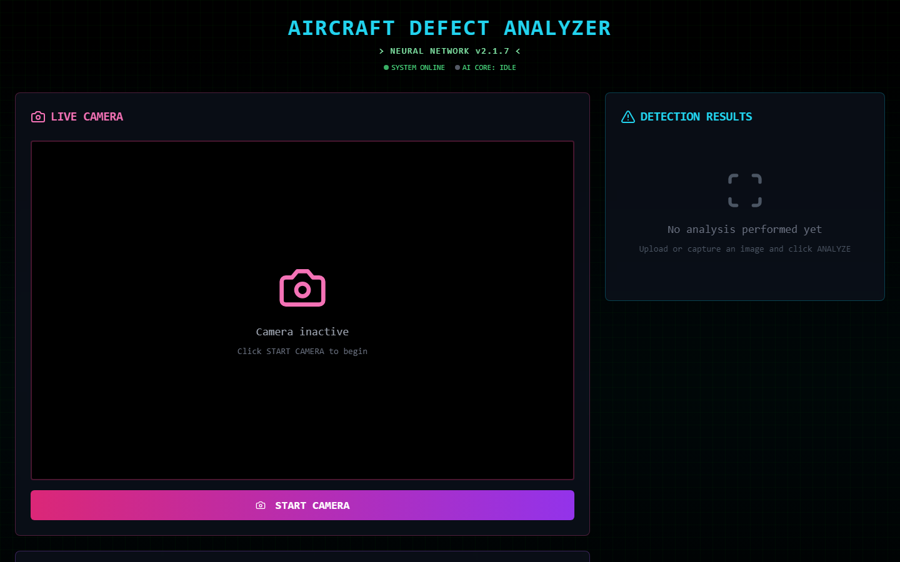

# Aircraft Inspector

A desktop and web app for detecting aircraft surface defects (missing head, paint-off, rust, scratch) from images, running a YOLO model exported to ONNX and executed client-side in the browser via `onnxruntime-web`.

Built with Next.js, React, Tailwind CSS, and packaged as a Windows desktop app with Electron.



## Download

Grab the latest Windows installer from [Releases](https://github.com/Kuakun55/aircraft-inspector/releases/latest).

## Prerequisites

- [Node.js](https://nodejs.org/) 18+
- [pnpm](https://pnpm.io/) (`npm install -g pnpm`)

## Setup

```bash
git clone https://github.com/Kuakun55/aircraft-inspector.git
cd aircraft-inspector
pnpm install
```

## Development

Run the web app in the browser:

```bash
pnpm dev
```

Then open http://localhost:3000.

Run as a desktop app (Electron) in dev mode:

```bash
pnpm electron:dev
```

## Building

Build the static web app:

```bash
pnpm build
```

Build the Windows installer (produces an NSIS installer under `release/`):

```bash
pnpm build:win
```

## Project structure

- `app/` – Next.js app router pages
- `components/` – React components (including shadcn/ui components under `components/ui/`)
- `aircraft-defect-detector.tsx` – main detector UI/logic
- `lib/yolo-inference.ts` – ONNX Runtime inference logic
- `public/model/best.onnx` – exported YOLO model used for inference
- `electron/` – Electron main process and packaging scripts

## Model utilities (optional, Python)

A few standalone scripts are included for re-exporting or testing the model outside the app. They require a Python environment with `ultralytics`, `onnxruntime`, `numpy`, and `pillow` installed, and reference local file paths that you'll need to adjust for your machine:

- `export_onnx.py` – exports a trained `.pt` YOLO model to ONNX
- `compare_inference.py` – compares PyTorch vs ONNX inference confidence on an image
- `test_model.py` – sanity-checks the ONNX model's inputs/outputs
